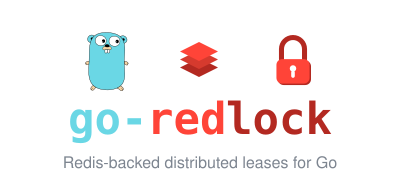

<p align="center">
  
</p>

# go-redlock

[](https://github.com/ndyakov/go-redlock/actions/workflows/ci.yml)

Redis-backed distributed leases for Go, implemented directly on
[`github.com/redis/go-redis/v9`](https://github.com/redis/go-redis).

The package deliberately exposes two algorithms instead of pretending that one
Redis topology fits every application:

- **Single Redis lease**: one logical Redis authority, the simplest and usually
  the best option. It supports atomic fencing-token generation.
- **Redlock lease**: an odd number of at least three independently operated
  Redis primaries, with majority acquisition and renewal.

Both modes use random ownership tokens, expirations, bounded Redis operations,
atomic compare-and-delete unlock, atomic compare-and-expire renewal, retry with
jitter, automatic renewal, and explicit lock-loss notification.

> A distributed lock is a time-bounded lease. It cannot stop a process that was
> paused beyond its lease from continuing to execute. Use fencing tokens or an
> atomic condition at the protected resource when stale work must be rejected.

## Installation

```sh
go get github.com/ndyakov/go-redlock
```

## Single Redis lease

Use this mode when all contenders share one logical Redis deployment.

```go
rdb := redis.NewClient(&redis.Options{Addr: "redis:6379"})

manager, err := redlock.NewSingle(rdb, redlock.Config{
    Expiry:           10 * time.Second,
    Attempts:         3,
    RetryDelay:       100 * time.Millisecond,
    OperationTimeout: 500 * time.Millisecond,
})
if err != nil {
    return err
}

lock := manager.NewLock("orders:{42}:lock",
    redlock.WithAutoRenew(3*time.Second),
    redlock.WithFencingToken("orders:{42}:fence"),
)

if err := lock.TryLock(ctx); err != nil {
    return err
}
defer func() {
    if err := lock.Unlock(context.Background()); err != nil {
        log.Printf("unlock: %v", err)
    }
}()

fence := lock.FencingToken()
if err := updateOrder(ctx, 42, fence); err != nil {
    return err
}

select {
case <-lock.Lost():
    return redlock.ErrLockLost
default:
}
```

When using Redis Cluster, the lock and fence keys must use the same hash tag,
as in `{42}` above, because the fenced acquisition Lua script touches both keys.

## Multi-master Redlock

Use Redlock only with independently operated Redis primaries. Three nodes give
a quorum of two; five nodes give a quorum of three.

```go
nodes := []redlock.Node{
    redis.NewClient(&redis.Options{Addr: "redis-a:6379"}),
    redis.NewClient(&redis.Options{Addr: "redis-b:6379"}),
    redis.NewClient(&redis.Options{Addr: "redis-c:6379"}),
}

manager, err := redlock.NewRedlock(nodes, redlock.Config{
    Expiry:           10 * time.Second,
    Attempts:         3,
    RetryDelay:       200 * time.Millisecond,
    DriftFactor:      0.01,
    OperationTimeout: 500 * time.Millisecond,
})
if err != nil {
    return err
}

lock := manager.NewLock("orders:42", redlock.WithAutoRenew(3*time.Second))
if err := lock.TryLock(ctx); err != nil {
    return err
}
defer lock.Unlock(context.Background())
```

Do not pass:

- three replicas belonging to one Redis primary;
- three addresses routed to the same Redis service;
- individual shards from one Redis Cluster as if they were independent nodes;
- an even number of nodes.

Replication and failover within each supplied logical node are deployment
concerns. Redlock's fault model requires the logical primaries themselves to
fail independently.

## Algorithms

### Ownership token

Every acquisition generates 20 cryptographically random bytes and encodes them
as a 40-character hexadecimal token. The same token is written to all nodes for
one Redlock attempt. It identifies an acquisition, not a process or hostname.

The token is essential for safe release. Deleting a key without checking its
value could delete a newer owner's lock after the old owner's lease expired.

### Single-node acquisition

Without fencing, acquisition is one Redis command:

```text
SET lock-key random-token NX PX ttl-ms
```

`NX` succeeds only when the lock does not exist. `PX` gives the key a finite
lifetime so a crashed owner cannot leave a permanent lock.

With fencing enabled, one Lua script performs these operations atomically:

```text
if lock-key does not exist:
    fence = INCR fence-key
    PSETEX lock-key ttl-ms random-token
    return fence
return 0
```

The counter is deliberately not deleted on unlock. Each successful acquisition
therefore receives a greater number than previous acquisitions.

### Redlock acquisition

For `N` independent nodes, quorum is:

```text
quorum = floor(N / 2) + 1
```

For every attempt the client:

1. records a local monotonic start time;
2. concurrently sends `SET key token NX PX ttl` to every node;
3. bounds the operation by `OperationTimeout` even if one node is slow;
4. counts successful responses;
5. calculates remaining validity;
6. accepts the lease only if a quorum succeeded and validity is positive;
7. otherwise compare-and-deletes its token from every node;
8. waits for `RetryDelay` plus up to 50% random jitter before retrying.

The validity calculation is:

```text
drift    = ceil(ttl * DriftFactor) + 2ms
validity = ttl - acquisitionElapsed - drift
```

The `time.Time` values used for local elapsed-time calculations carry Go's
monotonic clock reading. Redis key expiration itself is controlled by Redis.

### Unlock

Unlock executes this operation atomically on every node:

```text
if GET lock-key == random-token:
    DEL lock-key
```

The package uses Lua for compatibility across supported Redis versions. A node
holding a different token is never modified. Transport failures are returned
as `*redlock.QuorumError` with errors keyed by node index. After `Unlock` starts,
the local handle is no longer considered held even if cleanup is partial.

### Manual extension

`lock.Extend(ctx, ttl)` atomically executes the equivalent of:

```text
if GET lock-key == random-token:
    PEXPIRE lock-key ttl-ms
```

Single mode requires success on its one authority. Redlock mode requires a
majority and positive drift-adjusted validity. If renewal fails, the handle is
marked lost and compare-and-delete cleanup runs on all nodes, including any
minority that accepted the extension.

Extension does not create a new fencing token. It prolongs the same lease.

### Automatic renewal and lock loss

`WithAutoRenew(interval)` starts a goroutine after acquisition. At each interval
it runs the extension algorithm using the configured expiry. Renewal stops on
explicit unlock or its first failure.

`lock.Lost()` returns a channel that closes when renewal fails or an expired
handle is replaced. Work that can be cancelled should watch this channel:

```go
select {
case result := <-work:
    return result
case <-lock.Lost():
    return redlock.ErrLockLost
case <-ctx.Done():
    return ctx.Err()
}
```

Choose an interval that allows more than one operation-timeout window before
expiry. For a 30-second lease, renewing every 10 seconds is a typical starting
point. Renewal reduces accidental expiry; it does not replace fencing.

### Fencing tokens

Suppose owner A acquires token 10 and then pauses for longer than its lease.
Owner B acquires token 11 and writes successfully. When A resumes, the lock
alone cannot prevent A from writing stale data: A is executing outside Redis.

The protected resource must remember the highest accepted fencing token and
perform an atomic condition such as:

```sql
UPDATE orders
SET state = $new_state, last_fence = $token
WHERE id = $id AND last_fence < $token;
```

Token 10 is then rejected after token 11 has been accepted.

This package generates fencing tokens only in single-node mode. Independent
Redlock masters cannot jointly produce one linearizable, monotonically
increasing sequence without another consensus authority. A Redis-generated
counter can also regress after data loss or asynchronous failover, so configure
appropriate Redis durability and make the protected system's risk model
explicit.

## Configuration

| Field | Default | Meaning |
| --- | ---: | --- |
| `Expiry` | 30s | Redis TTL and duration used by automatic renewal |
| `Attempts` | 3 | Maximum acquisition attempts |
| `RetryDelay` | 200ms | Base delay; retry adds 0-50% jitter |
| `DriftFactor` | 0.01 | Fraction reserved for clock drift |
| `OperationTimeout` | min(`Expiry / 5`, 500ms) | Upper bound for one parallel node phase |

Callers should also set suitable go-redis dial, read, and write timeouts. The
package-level operation bound prevents acquisition from waiting for a slow
node, while client timeouts ensure abandoned network calls terminate promptly.

## Errors and state

- `ErrNotAcquired`: contention or insufficient successful nodes.
- `ErrAlreadyHeld`: the same `Lock` handle already owns a valid lease.
- `ErrNotHeld`: `Unlock` or `Extend` was called without local ownership.
- `ErrLockLost`: ownership expired, disappeared, or could not be renewed.
- `ErrFencingUnsupported`: fencing was requested in Redlock mode.
- `*QuorumError`: includes operation, success count, required count, and
  transport errors by node index. It unwraps to `ErrNotAcquired` for acquisition
  and `ErrLockLost` for renewal or cleanup.

Use `errors.Is` and `errors.As`; do not compare formatted error strings.

## What the algorithms guarantee—and what they do not

Within their timing and topology assumptions, the algorithms provide:

- ownership keys that eventually expire after a client crash;
- safe compare-and-delete release;
- majority acquisition and renewal in Redlock mode;
- bounded local waiting for slow or unreachable nodes;
- stale-worker rejection when a correctly enforced fencing token is available.

They do not provide an unconditional proof that arbitrary external work is
mutually exclusive. Long process pauses, machine suspension, network
partitions, Redis clock changes, data loss, and incorrect topology can invalidate
lease assumptions. Make critical operations conditional or idempotent at the
authoritative resource whenever possible.

## Testing

Unit tests use deterministic in-memory Redis-node doubles and cover quorum,
partial cleanup, ownership-safe unlock, fencing, timeouts, renewal loss, and
configuration validation.

```sh
go test -race ./...
go vet ./...
```

Single Redis integration test:

```sh
REDIS_ADDR=localhost:6379 go test -run TestIntegration -v
```

Three independent local Redis processes:

```sh
docker compose up -d
REDLOCK_REDIS_ADDRS=localhost:6381,localhost:6382,localhost:6383 \
  go test -run TestIntegrationRedlock -v
```

The Docker Compose setup is for testing only; three containers on one machine
do not have independent production failure domains.

## References

- [Redis distributed locks and Redlock algorithm](https://redis.io/docs/latest/develop/clients/patterns/distributed-locks/)
- [go-redis](https://github.com/redis/go-redis)
- [Martin Kleppmann's analysis of Redlock](https://martin.kleppmann.com/2016/02/08/how-to-do-distributed-locking.html)
- [Redis author's response](https://antirez.com/news/101)

## License

MIT

## Credits

The Go gopher in the logo was designed by [Renee French](https://reneefrench.blogspot.com/);
the vector version is by [Takuya Ueda](https://github.com/golang-samples/gopher-vector)
(CC BY 3.0).
